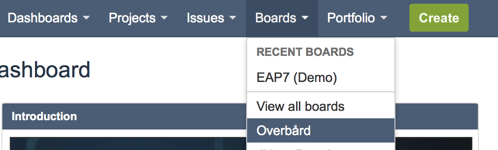
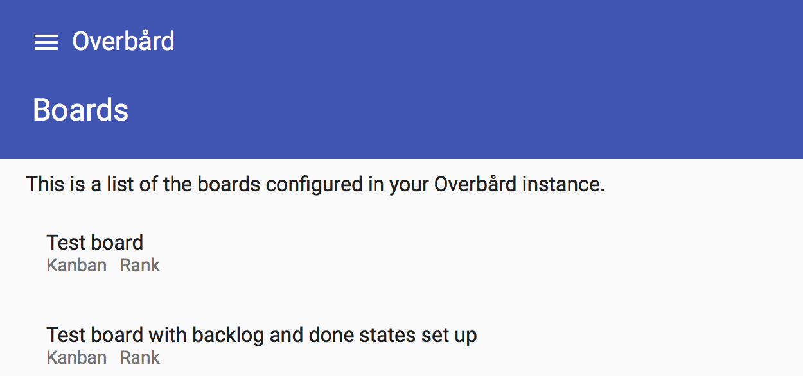
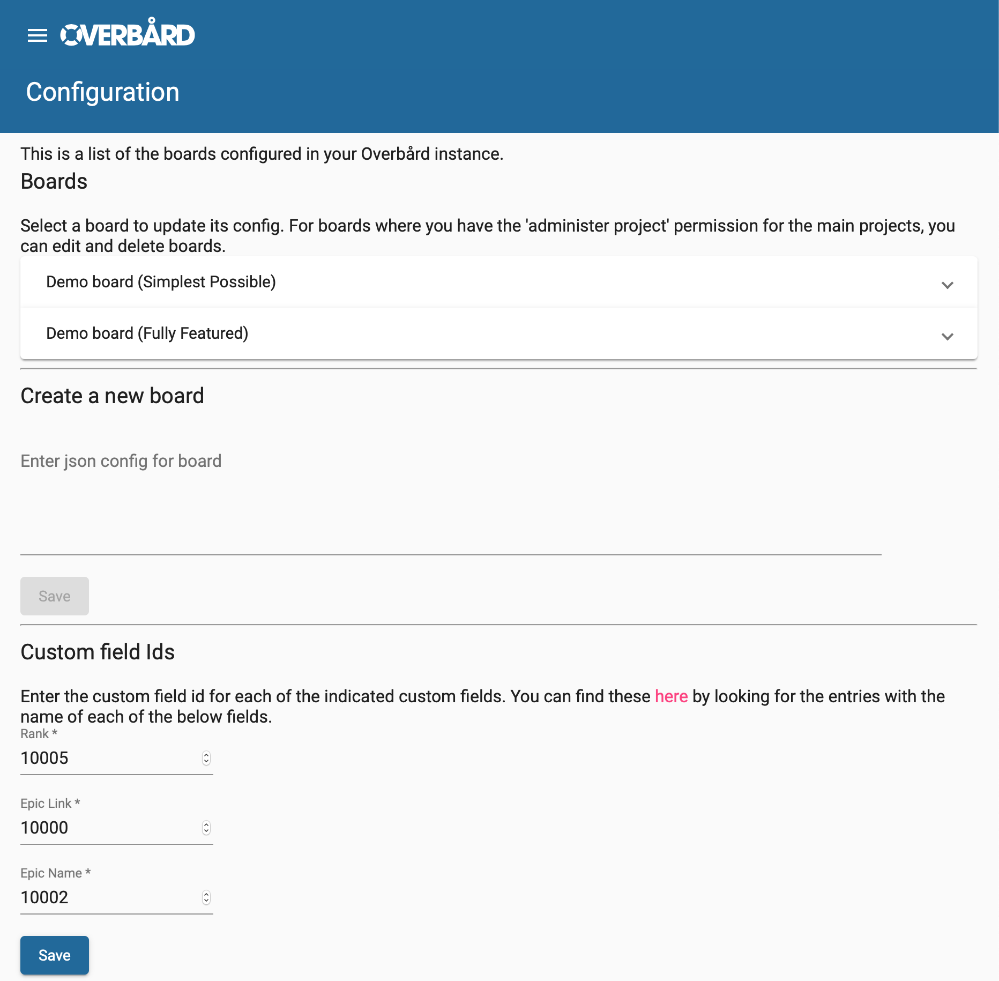

# 1 Prerequisites
You should have read the [User Guide](user-guide.md).

Overbård development started on Jira 7.5.x, and is currently running with no problems on Jira 7.12.0.
You must also have a Jira Software license which adds the Jira Agile functionality. If you don't have a license,
follow these [steps](jira-software-license.md).

Also, this guide assumes that you are familiar with, or able to look up in the Jira documentation, how to configure 
the underlying Jira concepts such as setting up projects, tweaking workflows and creating custom fields.


# 2 Configuration page
Go to your Jira instance, make sure you are logged in and click on the ‘Overbård’ entry in the ‘Boards’ menu.



You will then be presented with a list of boards configured on your Jira instance:



Then click on the hamburger icon in the top left, and select 'Config' from the left menu. You will now be presented
with the configuration page, where you can add new boards, and edit the configuration of existing ones. Boards are
configured using JSON, and the syntax will be explained in this guide.



## 2.1 Rank custom field id
An important step is to configure the rank custom field id. To do this, go to 
[http://my.jira.org/rest/api/2/field](http://my.jira.org/rest/api/2/field). Substitute 
[http://my.jira.org](http://my.jira.org) with the url of your Jira instance. If you are a developer
running Jira locally via the Atlassian SDK, this URL will by default be 
[http://localhost:2990/jira/rest/api/2/field](http://localhost:2990/jira/rest/api/2/field). Search for 'Rank' and get
the custom field id.

On my local instance this looks like:
```
{"id":"customfield_10005","name":"Rank","custom":true,
"orderable":true,"navigable":true,"searchable":true,
"clauseNames":["cf[10005]","Rank"],"schema":{"type":"any",
"custom":"com.pyxis.greenhopper.jira:gh-lexo-rank","customId":10005}}
```
so the id of the 'Rank' custom field is 10005. 

Enter the value you found into the 'Rank custom field id' field on the bottom of the configuration page.

# 3 Setting up a simple board
The following example discusses how to set up a very basic board, using a project with the standard states
when you create a project in Jira with the 'Kanban software development' workflow. Don't worry if you have an existing
project with different states, the concepts are the same.

The full JSON config can be found at [simple.json](assets/examples/simple.json). Let's look at it in details,
and describe the main sections.

## 3.1 Global config

```
{
  "name": "Simple board",
  "code": "SIMPLE",
```
First we define the 'name' of the board, which is what will appear in the list of boards. The 'code' is used 
in the URL used to link to the boards.

Next we define the states/columns for the board.
```
  "states": [
    {
      "name": "My Backlog",
      "backlog": true
    },
    {
      "name": "My Selected for Development"
    },
    {
      "name": "My In Progress"
    },
    {
      "name": "My Done"
    }
  ],
```
We can call the columns what we like, we will map them later to project states when we choose the projects to include 
in the board. Note that the `"backlog": true` setting for the 'My backlog' state column means that the column will
be considered the backlog. When loading a board, the backlog column is displayed in a different colour, and is 
collapsed by default.

Finally, for this simple example we define the issue priorities and issue types. For most other fields, Overbård will
use the data from the issues to determine the values available for filters and swimlanes. However, for the priorities
and issue types we give them a name and a colour. The name must match the name that shows up in Jira when selecting 
either and the colour will appear in the issue card headers. The colour must be something that would be valid
in standard html. Finally, as the priorities and issue types are both arrays,
this determines the order that these entries will show up in the board control panel.  
```
  "priorities": [
    {
      "name": "Highest",
      "colour": "red"
    },
    {
      "name": "High",
      "colour": "darkred"
    },
    {
      "name": "Medium",
      "colour": "orange"
    },
    {
      "name": "Low",
      "colour": "greenyellow"
    },
    {
      "name": "Lowest",
      "colour": "green"
    }
  ],
  "issue-types": [
    {
      "name": "Task",
      "colour": "blue"
    },
    {
      "name": "Story",
      "colour": "green"
    },
    {
      "name": "Bug",
      "colour": "red"
    },
    {
      "name": "Epic",
      "colour": "purple"
    }
  ],
```
## 3.2 Projects config
Next we have the configuration of the projects to display on the board. For this simple example we only display
one.
```
  "projects": [
    {
      "code": "PROJ",
```
'code' is the key of the project in Jira that we want to show on the board.
```
      "query-filter": null,
```
'query-filter' is optional, and is not set in this example. Behind the scenes, Overbård will execute a JQL query along the
lines of `project=PROJ [query-filter] ORDER BY Rank` so the 'query-filter' is a great way to narrow down the issues
loaded for the board.
```
      "colour": "#4667CA",
```
'colour' specifies the html colour code to use for issues from the specified project.
```  
      "state-links": {
        "Backlog" : "My Backlog",
        "Selected for Development" : "My Selected for Development",
        "In Progress" : "My In Progress",
        "Done" : "My Done"
      }
```
Finally we have a 'state-links' map which maps the states from the project's workflow to the state column names 
we created earlier.
``` 
    }
  ],
  "linked-projects" : {}
```
The 'linked-projects' are not needed, but are left here empty. They will be discussed later.
```  
}
```

# 4 Board with several projects

The previous section shows a simple board with just one project. We can also add several projects to our board.
The full JSON config can be found at [several-projects.json](assets/examples/several-projects.json). Most of
the JSON is the same as in the previous example; the difference is in the 'projects' section:
```
  "projects": [
    {
      "code": "PROJ",
      "query-filter": null,
      "colour": "#4667CA",
      "state-links": {
        "Backlog" : "My Backlog",
        "Selected for Development" : "My Selected for Development",
        "In Progress" : "My In Progress",
        "Done" : "My Done"
      }
    },
    {
      "code": "ANOTHER",
      "query-filter": null,
      "colour": "blue",
      "state-links": {
        "TODO": "My Backlog",
        "In Progress": "My In Progress",
        "Complete": "My Done"
      }
    }

  ],
```
As you can see we have added another project called 'ANOTHER' to the array of projects to be shown on the board. It has
a different 'colour' so we can easily see which issue cards belong to which project on the board. The configuration for
'PROJ' is the same as in the previous example. 

It is worth noting that the 'ANOTHER' project uses a different workflow from 'PROJ'. It has less states, and the states
have different names from the states used in the 'PROJ' project.

One thing to note is that there is no overall ranking across projects. Rather issues are presented in rank order for 
each project separately. The order of the display of issues by project is the same as their order in the 'projects' 
array. In other words, for this example, that means that in each column on the board, issues from 
'PROJ' will be displayed in rank order, and then the issues from 'ANOTHER' will be displayed in rank order.   

# 5 Board with advanced headers

We will now have a look at some of the more advanced configuration options to set up the headers.
The full JSON config can be found at [headers.json](assets/examples/headers.json). Again we will focus on the
differences from the previous examples:
```
  "states": [
    {
      "name": "Backlog",
      "backlog": true
    },
    {
      "name": "High Priority Backlog",
      "backlog": true,
      "help": "This is the high priority backlog!\n\nSomeone important has decided these are the top priority"
    },
```
Note that there are two `"backlog": true` states in our list of states. These two states will be grouped under a header,
which will be collapsed by default when the board is first loaded. Both states will have the alternative colour used
for the backlog in Overbård.

You can use `"backlog": true` on as many states as you like, but they must all be at the start of the array of states.

The text specified by `help` gives a tooltip that shows up when you hover over the state column header when looking at 
the board. The text in `help` can contain newlines, as shown above.

```
    {
      "name": "In Progress",
      "wip": 10,
      "header": "Development"
    },
    {
      "name": "Pull Request Sent",
      "header": "Development",
      "help": "A pull request has been sent"
    },
```
The above two states are grouped using the `header` field. They will still both show up as individual columns, 
but will be grouped under a header. The header can be used to collapse/expand all the contained states at the same time.
Note that when using `header` the states must be contiguous, no gaps are allowed. 

The 'In Progress' state has a wip limit of 10. If the state has more issue than that the column counts in the 
header will become red.

 
```    
    {
      "name": "QA TODO",
      "header": "QA"
    },
    {
      "name": "QA In Progress",
      "header": "QA",
      "help": "QA is trying to break the feature"
    },
```    
Above we have two states under the 'QA' header.  
```
    {
      "name": "Verified"
    },
```
Although we have been using headers for our states so far, we don't have to do that for all states. The 'Verified'
state shown above does not use headers.
```
    {
      "name": "Closed",
      "done": true
    }
```    
The `"done": true` state is a special case. It will *not* be shown on the board! Rather it is a signal for when
we do the project state-links for which issues to ignore
```     
  ],
  ...
  "projects": [
    {
      "code": "PROJ",
      "query-filter": null,
      "colour": "#4667CA",
      "state-links": {
        "Backlog": "Backlog",
        "High Priority Backlog": "High Priority Backlog",
        "In Progress": "In Progress",
        "Pull Request Sent": "Pull Request Sent",
        "QA TODO": "QA TODO",
        "QA In Progress": "QA In Progress",
        "Verified": "Verified",
        "Closed": "Closed",
        "Shipped": "Closed"
      }
    }
  ],  
```
In our 'PROJ' project, we map issues in the 'Closed' and 'Shipped' states from PROJ's workflow to the 'Closed' column 
on the board. Remember that the 'Closed' column is not actually shown since it is marked with `"done": true`. Rather 
what happens, is that when executing the JQL to load the board into the Overbård server-side cache, issues from
these states are omitted. It is a mechanism to not load now irrelevant issues into Overbård. 

# 6 Board with custom fields

By default Overbård will automatically populate swimlanes and options for filtering from the issue data for:

* Assignee
* Component
* Label
* Fix Version

In addition it presents the options to use swimlanes and options for filtering issues for (we have seen 
in the previous sections that some minimum configuration is needed to set these up): 

* Project
* Issue Type
* Priority

However, we can further extend the functionality of Overbård to do this for custom fields. So far (because they were 
 needed for managing the JBoss EAP project at Red Hat) it supports two types:

* `version` - For my project we have a custom field called 'Target Release'. It is a custom field which allows selection
of one release. The 'version' custom field type is suitable for such a custom field. 
* `user` - For EAP we have a custom fields called 'Tester' and 'Documenter'. In Jira these are 'User Picker (single user)' 
custom fields. The 'user' custom field type is suitable for such a custom field. 

If you want support for other types of custom fields, open an [issue](https://github.com/overbaard/overbaard/issues)
and we can discuss the viability.

Let's take a look at how to configure a 'Tester' custom field (of type 'user')for a board. The full JSON config
can be found at [custom-field.json](assets/examples/custom-field.json). The important parts are discussed below.

In the global part of the configuration we declare the custom fields we are interested in.
```
  "custom": [
    {
      "name": "Tester",
```
'name' is the name that will be used for the field when presented in the list of swimlanes options and in its 
corresponding filter header.
```
      "type": "user",
```
We specify that it is of type 'user' as discussed above.
```      
      "field-id": 121212121212
```
This is the Jira id of the field we are interested in. You can find this by going to 
[http://my.jira.org/rest/api/2/field](http://my.jira.org/rest/api/2/field) (adjusting the URL as mentioned earlier), 
or by going to the 'Issue Types' screen in the Jira Administration section of your Jira instance.
```
    }
  ],
``` 

Next we configure the custom field for use with projects it should be used for. This is because a board can have 
more than one project and custom fields might not be relevant to all of them.

```
  "projects": [
    {
      "code": "PROJ",
      "query-filter": null,
      "colour": "#4667CA",
      "state-links": {
        ...
      },
      "custom": [
        "Tester"
      ]
```
Here we have listed the custom fields that we should use for the 'PROJ' project. It is a list of the 'name' fields
of the custom fields we want to use for the project. Now when loading the board, Overbård will inspect all issues
in the 'PROJ' project and also look for the values of this field, which will be available in the 'Tester' filter and 
swimlanes!
```      
    }
```

# 7 Linked projects/issues 

As discussed in the [User Guide](user-guide.md) we can configure a board's issue cards to show links to linked issues 
from other projects. This section describes how to do this. The full JSON config
can be found at [linked-issues.json](assets/examples/linked-issues.json), and the important parts are discussed below.

First we need to populate the 'linked-issues' section that we have touched upon before:
```
  "linked-projects": {
    "FIRST": {
      "states": [
        "TODO",
        "In Progress",
        "Done"
      ]
    },
    "SECOND": {
      "states": [
        "Backlog",
        "In Progress",
        "QA",
        "Verified"
      ]
    }
  }
```
We have declared two projects that we are interested in: 'FIRST' and 'SECOND'. For each project, we list the
states from their individual workflows. These are listed in order, and are used as a lookup to determine a colour
for the linked issue in board issue it is linked to from. For example a 'SECOND' issue in the 'Backlog' state will appear
as red, and a 'SECOND' issue in 'Verified' will appear as green.

Next we need to reference these linked projects from our main projects. Again we might have more than one project
configured for the board, and they might have different interests in which issues from the linked projects they should
display. In the following example the 'PROJ' project is set up to reference both linked projects, via the 'linked-issues'
field. The 'linked-issues' field has a 'filter' attribute that can be used to narrow down which issues are selected.  
```
  "projects": [
    {
      "code": "PROJ",
      "query-filter": null,
      "colour": "#4667CA",
      "state-links": {
        ...
      },
      "linked-issues": [
        {
          "projects": [
            "FIRST"
```
We are interested in issues from the 'FIRST' linked project. Although this list just contains one entry, we could have
added more.
```            
          ],
          "filter": {}
```
The filter is empty so any issue from 'FIRST' linked to by 'PROJ' issues will be shown on the board.
```          
        },
        {
          "projects": [
            "SECOND"
```
Here we are interested in issues from the 'SECOND' project.
```            
          ],
          "filter": {
            "issue-types": [
              "Bug",
              "Task"
            ],
            "priorities": [
              "Highest"
            ],
            "labels": [
              "Upstream_feature"
            ],
            "link-names": [
              "cloned to",
              "cloned from"
            ]
          }
```
This filter specifies that the 'PROJ' issue cards should include linked issues from the 'SECOND' project but only if the
linked 'SECOND' issue:
* has a type of 'Bug' or Task, and
* has a priority of 'Highest', and
* is labelled with the 'Upstream_feature' label, and
* the link type is either 'cloned to' or 'cloned from'

You can use as few or as many of these fields as you like to narrow down exactly which linked issues you are interested 
in.
```          
        }
      ]
    }
``` 

# 8 Parallel tasks

As mentioned in the [User Guide](user-guide.md) Overbård has a feature called Parallel Tasks. The way we use them on 
the EAP project is that there are a set of requirements worked on by different teams that should be satisfied by the time
we merge a feature. Some of these are:
* Analysis Document - it needs to be written and agreed upon by the different stakeholders
* Documentation  - it needs to be written, and reviewed by the various teams
* Test Development - Done by the QE team along with the development of the feature
* Pre-Check - Once the feature is complete, QE checks that the new tests work and that no regressions are introduced.

These are things which:
* need to be done for all new features
* often involve cross-team collaboration
* each have more than one state (so a simple checkbox won't do). E.g. the Analysis Document Parallel Task has the states
'TODO', 'In Progress', 'Review", 'Approved' 
* if split up into Jira sub-tasks would seriously clutter up the board, with no immediate view of how each issue's
tasks are progressing.

To set up Parallel Tasks in Overbård, you first need to configure a custom field for each Parallel Task in Jira. The
custom fields must be of the type 'Select List (single choice)'. For each field give them the values you want (in the 
Analysis Document example mentioned, you would specify 'TODO', 'In Progress', 'Review" and 'Approved' ), and set the 
first one as the default value. The order of the values is important and should be from start to finish, as the colour
shown for each parallel task on the issue cards gives an indication of how far the task has progressed, with red being 
'not started' (i.e. the first ) value and green being the 'finished' (i.e. the last) value.

Then associate these custom fields with the screens for your project.

Then in Overbård we configure the Parallel Tasks as shown in [parallel-tasks.json](assets/examples/parallel-tasks.json).
The notable parts follow:
```
  "parallel-tasks": {
    "fields": [
      {
        "name": "Analysis Document",
        "type": "parallel-task-progress",
        "field-id": 121212121212,
        "display": "AD"
      },
      {
        "name": "Documentation",
        "type": "parallel-task-progress",
        "field-id": 121212121213,
        "display": "DC"
      },
      {
        "name": "Test Development",
        "type": "parallel-task-progress",
        "field-id": 121212121214,
        "display": "TD"
      },
      {
        "name": "Pre-Checked",
        "type": "parallel-task-progress",
        "field-id": 121212121215,
        "display": "PC"
      }
    ]
  },
```
Similar to custom fields, we define all the parallel tasks in the `parallel-tasks` section in the global 
part of the configuration. Each parallel task has:
* a `name`, which is displayed in the board filters in the control panel 
* a `type` which is always `parallel-task-progress`
* a `field-id` which is the id of the custom field, which you 
can find by going to [http://my.jira.org/rest/api/2/field](http://my.jira.org/rest/api/2/field) 
(adjusting the URL as mentioned earlier). 
* a `display` value. This is a two letter code which appears for each
parallel task in the parallel task section in the issue cards. Note that we are not configuring any values for the 
parallel tasks here, those are loaded from each of the custom field configuration that we set up earlier in this section.

Next, we need to associate the parallel tasks for the project (on a board where we have more than one project, each
project might have different or intersecting parallel task requirements):

```
  "projects": [
    {
      "code": "PROJ",
      "query-filter": null,
      "colour": "#4667CA",
      "state-links": {
        ...
      },
      "parallel-tasks": [
        [
          "Analysis Document",
          "Documentation"
        ],
        [
          "Test Development",
          "Pre-Checked"
        ]
      ]
    }
```
Note that the parallel tasks are grouped, so that `AD` (Analysis Document) and `DC` (Documentation) will appear in 
one group and `TD` (Test Development) and `PC` (Pre-Checked) will appear in another.

# 9 Issue type overrides

This a slightly more advanced topic, which builds on what we have learnt so far. We have seen how to map project states
to the Overbård columns, and how to configure parallel tasks and linked issues on a per project basis. However, for the 
state mappings, different issue types can have different workflows which in turn means a set of different states.
Similarly, parallel tasks and linked issues may be relevant to one issue type but not the others, or different issue 
types might have different parallel task and linked issue needs.

# 9.1 State mapping overrides
[state-mapping-overrides.json](assets/examples/state-mapping-overrides.json) shows a sample config for configuring
different state mappings for different issue types.

In short what the below snippet does is define different state mappings for issues which have the type 
`Task` or `Bug`. Issues which do not have these issue type have the standard state mappings. 

```
  "projects": [
    {
      "code": "PROJ",
      "query-filter": null,
      "colour": "#4667CA",
      "state-links": {
        "Backlog": "Backlog",
        "Selected for Development": "Selected for Development",
        "In Progress": "In Progress",
        "Done": "Done"
      },
      "overrides": {
        "state-links": [
          {
            "issue-types": ["Task", "Bug"],
            "override": {
              "TODO" : "Backlog",
              "In Progress" : "In Progress",
              "Verified": "Done"
            }
          }
        ]
      }
    }
  ],
```

# 9.2 Parallel task overrides
[parallel-task-overrides.json](assets/examples/parallel-task-overrides.json) shows a JSON config for setting up
different parallel tasks for different issue types. 

The set up of the parallel tasks in the global section of the configuration is the same as we have seen before. The 
example uses a board with two projects to be able to show all permutations in one example.


```
  "projects": [
    {
      "code": "PROJ",
      "query-filter": null,
      "colour": "#4667CA",
      "state-links": {
        ...
      },
      "parallel-tasks": [
        [
          "Analysis Document",
          "Documentation"
        ],
        [
          "Test Development",
          "Pre-Checked"
        ]
      ],
```
The above are the parallel tasks for issues in the `PROJ` project. These will be used for issue types
that there are no overrides for. (As we have overrides for `Task`, `Story` and `Bug`, in effect this means that only
issues that have the type `Epic` will use these default parallel tasks). 
```     
      "overrides": {
        "parallel-tasks": [
          {
            "issue-types": ["Task", "Story"],
            "override": [
              [
                "Analysis Document",
                "Documentation"
              ]
            ]
          },
```
Issues in project `PROJ` that have an issue type of `Task` or `Story` only use the `Analysis Document` and 
`Documentation` parallel tasks.
```          
          {
            "issue-types": ["Bug"],
            "override": null
          }
```
Issues in project `PROJ` that have an issue type of `Bug` have parallel tasks disabled.
```          
        ]
      }
    },
    {
      "code": "ANOTHER",
      "query-filter": null,
      "colour": "blue",
      "state-links": {
        ...
      },
```
In the `ANOTHER` project, there are no project wide parallel tasks configured. There is an override for the 
issue type `Task`, so that issues of that type will have the parallel tasks shown below. Issues of any other type
will not have parallel tasks. 
```      
      "overrides": {
        "parallel-tasks": [
          {
            "issue-types": ["Task"],
            "override": [
              [
                "Analysis Document",
                "Documentation"
              ],
              [
                "Test Development",
                "Pre-Checked"
              ]
            ]
          }
        ]
      }
    }
  ],
```

# 9.3 Linked issue overrides
[linked-issue-overrides.json](assets/examples/linked-issue-overrides.json) shows a JSON config for setting up
different parallel tasks for different issue types. As before let's look at the `linked-projects` section first. It
looks a lot like it did before but `SECOND` has a new `type-states` map. This is needed if the `SECOND` project
has different workflows for different issue types. As mentioned the earlier the state of the linked issue is used to 
calculate a colour for the linked issue (with red denoting the first state, and green the last state). If the linked
issue from the `SECOND` project has the type `Task` or `Bug` the relevant set of states will be used to calculate the 
colour. For all other issue types, the list of states in the `states` field will be used.  
 
```
  "linked-projects": {
    "FIRST": {
      "states": [
        "TODO",
        "In Progress",
        "Done"
      ]
    },
    "SECOND": {
      "states": [
        "Backlog",
        "In Progress",
        "QA",
        "Verified"
      ],
      "type-states": {
        "Task": ["TODO", "In Progress", "Done"],
        "Bug": ["TODO", "Doing", "Done"]
      }
    }
  }
```

The above is an extra dimension to overrides for linked issues. The next part is similar to what we already saw for
parallel task and state mapping overrides:

```
  "projects": [
    {
      "code": "PROJ",
      "query-filter": null,
      "colour": "#4667CA",
      "state-links": {
        "Backlog": "Backlog",
        "Selected for Development": "Selected for Development",
        "In Progress": "In Progress",
        "Done": "Done"
      },
      "linked-issues": [
        {
          "projects": [
            "FIRST"
          ],
          "filter": {
            "priorities": ["High"]
          }
        }
      ],
      "overrides": {
        "linked-issues": [
          {
            "issue-types": ["Story"],
            "override": [
              {
                "projects": ["FIRST"],
                "filter": null
              },
              {
                "projects": ["SECOND"],
                "filter": {
                  "priorities": ["High"]
                }
              }
            ]
          }
        ]
      }
```
Here we have an override for when the `PROJ` issue is of type Story, and a `linked-issues` setting for the project. 
If the issue type is *not* `Story` we will display all linked issues from the `FIRST` linked project where the priority 
is `High`. If the issue type is `Story`, we do not display linked issues from the `FIRST` project, and display all 
linked issues from the `SECOND` project where the priority is `High`.
```
    },
    {
      "code": "ANOTHER",
      "query-filter": null,
      "colour": "blue",
      "state-links": {
        "Backlog": "Backlog",
        "Selected for Development": "Selected for Development",
        "In Progress": "In Progress",
        "Done": "Done"
      },
      "overrides": {
        "linked-issues": [
          {
            "issue-types": ["Story"],
            "override": [
              {
                "projects": ["FIRST"],
                "filter": {
                  "priorities": ["Highest"]
                }
              }
            ]
          }
        ]
      }
```
For the `ANOTHER` project there is no `linked-issues` setting for the project, but there is an override for when the
issue type is `Story`. So, if the `ANOTHER` issue type is `Story` we link to issues from the `FIRST` project that have
the `Highest` priority. Issues with other issue types in the `ANOTHER` project do not get linked issues displayed on 
the board.
```   
    }    
  ],
```

# 10 Diagnosing problems

When entering the board configuration, if you have got something wrong the server will validate the JSON to see if it
is valid configuration. It will also (at least in most cases!) display an error message to help you pinpoint what went 
wrong.

## 10.1 Health Panel

Once you have successfully saved the board config, if you go and view the board, you might get a message about an error
having happened loading the board, and be asked to view the health panel. The health panel is accessed by clicking
the alarm clock icon in the bottom right. This icon will only be shown if there actually is a problem.

The health panel will list issues that there is a problem with, and it will be due to either:
* an issue loaded which has a type not configured in the `issue-types` section in the global configuration
* an issue loaded which has a priority not configured in the `priorities` section in the global configuration
* an issue loaded which has a state not configured in the project or the relevant overrides `state-links` map.

To get rid of the health panel warning, go in and add the issue type, priority or the missing state.
