# Overbård User Guide

This guide shows you how to use Overbård as an end user once boards have been set up. We also have 
an [admin guide](admin-guide.md) showing how to set up new boards, and a
[developer guide](developer-guide.md) if you are interested in contributing. 

## 1 Finding Overbård

To use Overbård, you need to be logged into your Jira instance. Then click on the 
'Overbård' entry in the 'Boards' menu.

 

You will then be presented with a list of boards configured on your Jira instance:


To go to a board click on the name of a board, and you will get taken to it. See the [board](#2-board) section 
for how to work with a board.  

### 1.1 Left menu

If you click on the hamburger icon in the top left, you get presented with the left hand menu. It has the 
following links:
* Boards - the list of boards configured in your Jira instance, as described in the previous section.
* Config - takes you to where the boards are configured. This is covered in the [admin guide](admin-guide.md), 
and is out of scope for this user guide.
* Back to Jira - takes you to the host Jira instance.
* Help - takes you to this guide.
* GitHub - takes you to the https://github.com/overbaard/overbaard GitHub repository where 
you can track the progress of the project, create issues in case you find a bug etc. 


## 2 Board

Having clicked on a board in the boards list, you will be presented with a view of the board:


The board is scrollable horizontally and vertically so you can see all issues in all states. If you click on the 
issue's key, in the card header, you get taken to the issue in Jira.

<!-- TODO discuss linked issues -->

The board polls Jira on a regular basis, so changes made to issues on the board will get reflected 
on the board.

### 2.1 Backlog and collapsible headers

When you first view a board, the backlog is hidden, as shown in the previous section. To view issues in the backlog,
click on the left-most column header and the backlog will be displayed:

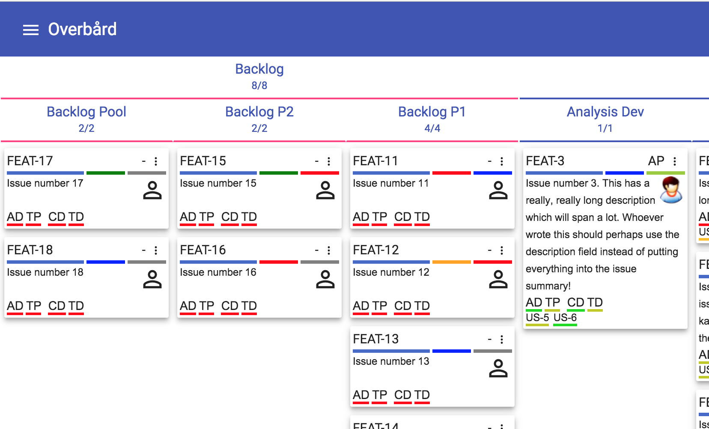 

Similarly you can expand or collapse any column by clicking on it:

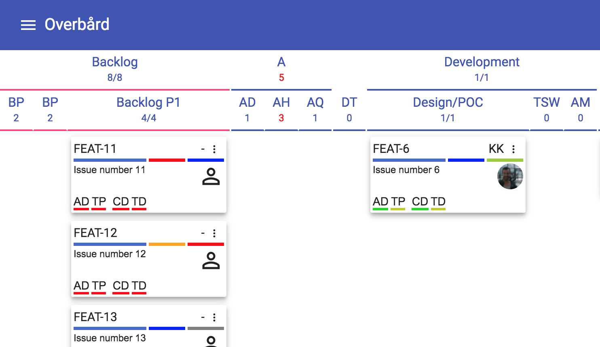

Note that as you collapse and expand columns, the state of what is visible or not is refected in the browser
address field so you can share links with fellow users.

### 2.2 Health panel

If there are some problems in the board's configuration, an alarm icon will be displayed in the bottom right of
the board. Clicking on it displays the health panel, which provides the board administrator with the required 
information to fix the configuration. This is covered in the [admin guide](admin-guide.md), and is out of scope 
for this user guide.

### 2.3 Control panel

The control panel is the entry point to being able to alter the display of the board at runtime. All the data 
is tweaked on the client, so there are no extra roundtrips to the server when doing so which makes it very fast. 
You can select the level of detail to be used when displaying the data, choose swimlanes, and filter the issues. 
To view the control panel, click on the cog icon in the bottom right of the board. As you make changes to the 
settings of the board, the browser address field field gets updated with a URL to take you to the currently 
configured board so you can share links with your friends. 

Here is the open control panel:

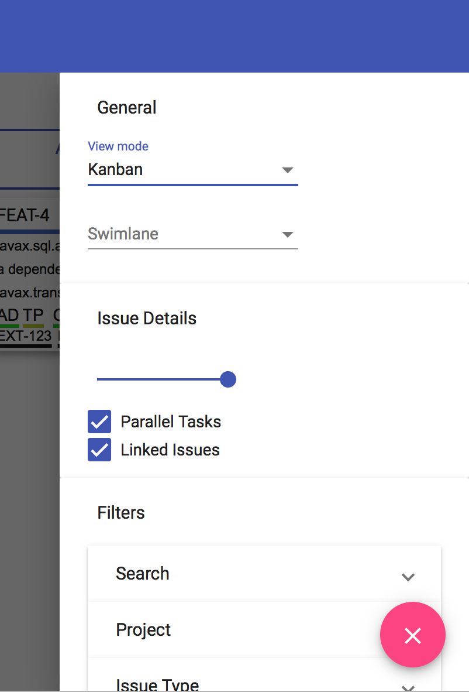

As the number of entries is longer than the window height, the control panel is scrollable. It is divided into 3 
main sections:

* General - this toggles the view
* Issue details - controls the verbosity of what is shown in the issue cards
* Filters - used to search for issues

#### 2.3.1 General

This section controls the view of the board. It has two settings:
* View Mode - this defaults to the 'Kanban' view which is what we have been seeing so far. The other setting is the 
'Rank' view.
* Swimlane - the default is no swimlanes. When the Rank view is shown, this setting is not displayed.
On all boards in the Kanban view you can select swimlanes for Project, Issue Type, Priority, Assignee, Component, 
Label and Fix Version. Also, if the board administrator has configured certain custom fields to be available in the 
board they will be part of the swimlane options.

##### 2.3.1.1 Rank view
While the Kanban view is well known, and the standard way of displaying a Kanban board, for huge projects once you have
moved issues out of the backlog into other states you lose the global overview of how far issues have progressed
with regard to the ranking. For example in the following board (still using the Kanban view):

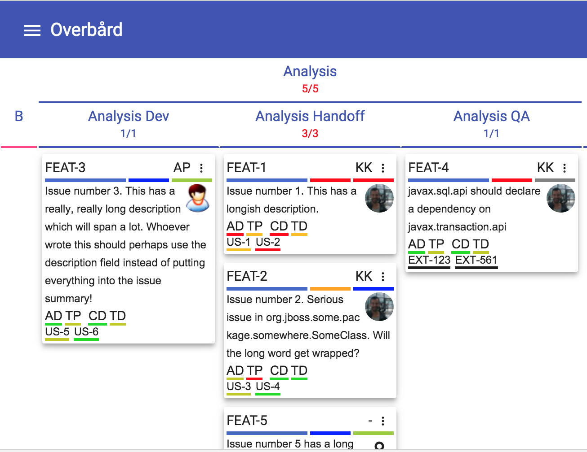
 
We can see that `FEAT-1` is higher ranked than `FEAT-2` which in turn has a higher rank than `FEAT-5`. But we don't 
know how highly ranked `FEAT-3` or `FEAT-4` are compared to `FEAT-1`, `FEAT-2` or `FEAT-3`. To find this out, we can
switch to the Rank view:

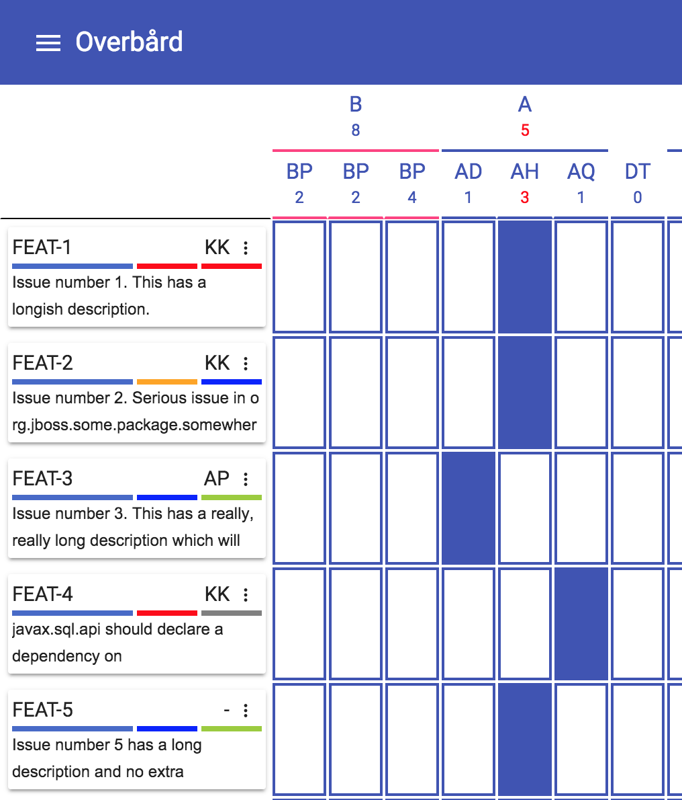

Note that although we have not covered this yet, I have changed the 'Issue details' setting so that we see more issues. 
This view shows all the issues in global rank order, along with how far each has moved through the workflow states.
From this we can tell that the `FEAT-4` has a low rank, but has moved further through the process than the higher
ranked issues. Also, `FEAT-5` is in a later state than the higher ranked `FEAT-3`. Heads will roll at the next 
standup meeting!

##### 2.3.1.2 Swimlane view
Back in the Kanban view, we can select to display the board using swimlanes. Here I have chosen to display it using
swimlanes by issue priority: 
 


By default swimlanes which have no issues associated with them will *not* be shown. To show empty swimlanes on the 
board anyway, click the 'Show Empty' button to toggle this.

Similar to how we can collapse and expand state columns by clicking on the state header, we can collapse and expand 
swimlanes by clicking on the swimlane header:
 
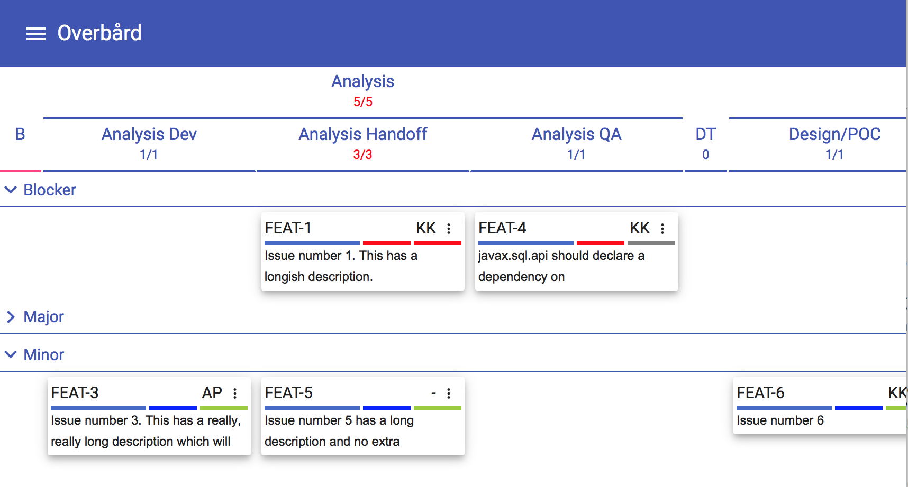

Here we have collapsed the 'Major' swimlane and the 'DT' state column.

#### 2.3.2 Issue details
By default the issue cards are shown including all the available information. In some cases it can be nice to have 
a more summarised view. In this section there is a slider to control the amount of information. It has 4 levels:

1) Shows all details, no trimming is performed. This is the default.
2) Trims the description to two lines, and keeps the avatar icon.
3) Trims the description to two lines, removing the avatar icon.
4) Only shows the issue headers.

In addition there are two checkboxes to disable showing the parallel tasks and linked issues sections on the bottom 
of each card. Note that these are only shown if the board is configured to show parallel tasks and linked issues.

#### 2.3.3 Filters and search
The final main section in the control panel are the setting of filters. Click on each of the accordion entries to get 
a wider view. 

On all boards in the Kanban view there will be an entry for Search, Project, Issue Type, Priority, Assignee, Component, 
Label and Fix Version. If the board has been configured to use custom fields or parallel tasks, there will be entries 
for these as well. The filters work the same in both the Kanban and the Rank views.

Within each filter entry there is an OR relationship. So if you have selected issue types 'Bug' and 'Story' as shown 
here:


Only issues that have issue type 'Bug' OR 'Story' will be shown. Across the filter types there is an AND relationship. 
So if you leave issue types 'Bug' and 'Story' selected and choose priority 'Blocker':

  

we end up with less issues because the query behind the scenes becomes something along the lines of:
```
(issueType = 'Bug' OR issueType = 'Story') AND priority = 'Blocker'
``` 

In the previous image it is worth pointing out the icon next to 'Issue Type' in the collapsed filter entry. This 
indicates that some filters have been set, and if you hover over the filter name, you will see which filters have
been set without needing to expand it again. If you click on the icon, it will clear the 'Issue Type' filters. 
Similarly, in the open 'Priority' filter entry the three icons allow you to:
* invert the selection
* select all filters (which is effectively the same as selecting none)
* clear the filters

Note that for filters for fields in Jira that allow a null value (such as Assignee, Labels, Components etc) there is a 
special filter value called 'None', which allows you to pick out issues which do not have the field in question set.

##### 2.3.3.1 Taming long filter lists
If the list of settable values for a filter is long as shown here, you will need to scroll to see all filter values:

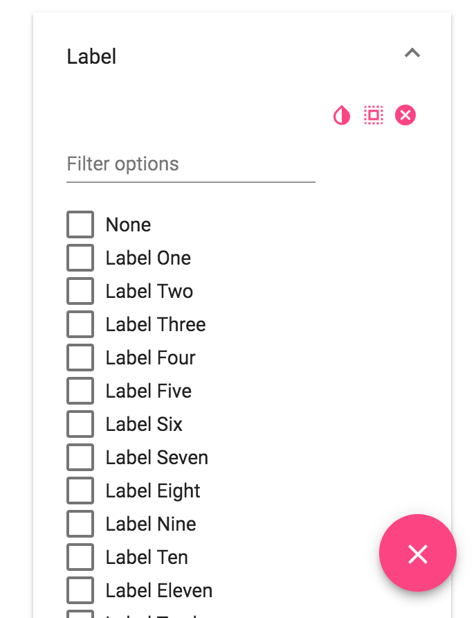

In these cases a search box appears above the list of filter values. If you know the name of the filter value you want to
set, you can search for it:

 

##### 2.3.3.1 Search

A special case of filter is Search, which appears at the top of the filters list. The standard setting greys out 
the issues that do not match the search:


As you can see we are looking for issues where the issue id is 'FEAT-1' or 'FEAT-5', where the summary also 
contains the text 'longi'. For the 'Issue Ids' field suggestions for issue ids are presented as you type into the 
field. The 'Issue Text Search' box must contain at least three characters for it to have any effect. 

The final 'Hide non-matching' toggle, if set, makes the search behave more in line with normal filters by hiding, 
rather than greying out, non-matching issues:

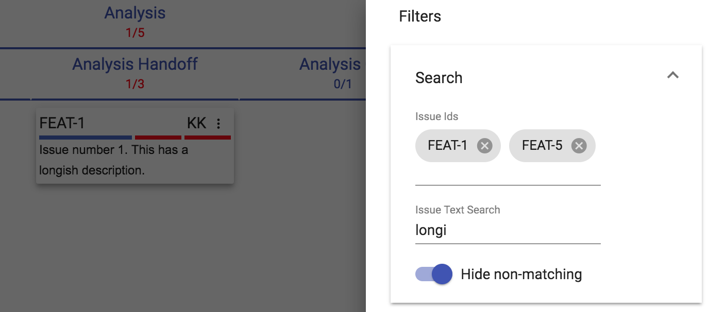

##### 2.3.3.2 Filters and swimlane

You can combine swimlanes and filters. The below image shows the board arranged in swimlanes by priority, 
but only showing the minor issues. Since we are not showing any of the other priorities their swimlanes 
are completely hidden on the board:

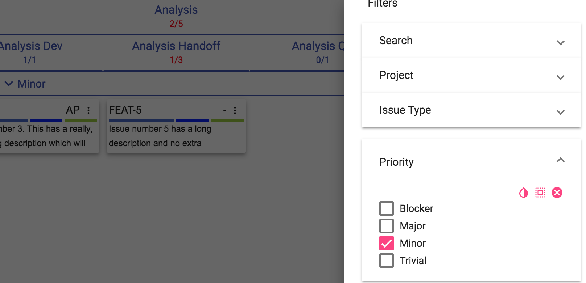

## 2.3 Issue cards

Let's take a look at an issue card in detail:

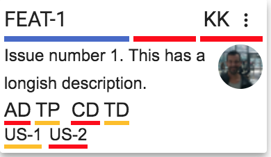

The top line contains the issue's Jira id ('FEAT-1'), the assignee initials ('KK') and a button to open the 
issue context menu. If you hover the mouse over the Jira issue id, a tooltip will display the full information
about the issue.

Then we have a line with three coloured sections. The first is the colour configured for the project (boards can be 
configured to show more than one project). The second represents the priority of the issue, and the third the issue 
type. If you hover your cursor over one of these a tooltip will show the meaning of the colour.

The main section of the card contains the issue summary, and an avatar for the assignee on the right.

The 'AP', 'TP', 'CD', 'TP' entries are called *parallel tasks*. Not all boards are configured to have these, but on
boards that have these they represent the completeness of a subtask that must be done as part of an issue's 
workflow. The colour for each ranges from red (not started) to green (done), Think checkboxes on steroids! 
If you hover over each of these a tooltip will give the full name of the parallel task and its state. 
e.g. we can see that the 'AD' one means 'Analysis Document', and its state is 'TODO':


Finally we have a line containing the linked issues. For our card we list 'US-1' and 'US-2'. This means that our
issue has links to these issues. Note that not all linked issues are shown, just ones for projects and issue types
the administrator set up. 

Now we will explore some of the areas of the issue cards which need to be covered in more depth.

### 2.3.1 Issue context menu

Right-clicking on an issue you get the context menu. It currently allows you to Move (Kanban view), or Rank (Rank view),
as well as comment on issues.

#### 2.3.1.1 Move 

Moving in issue means moving it to another state. If you click on the 'Move' issue context menu item you get presented 
with a list of the states the issue can move to:

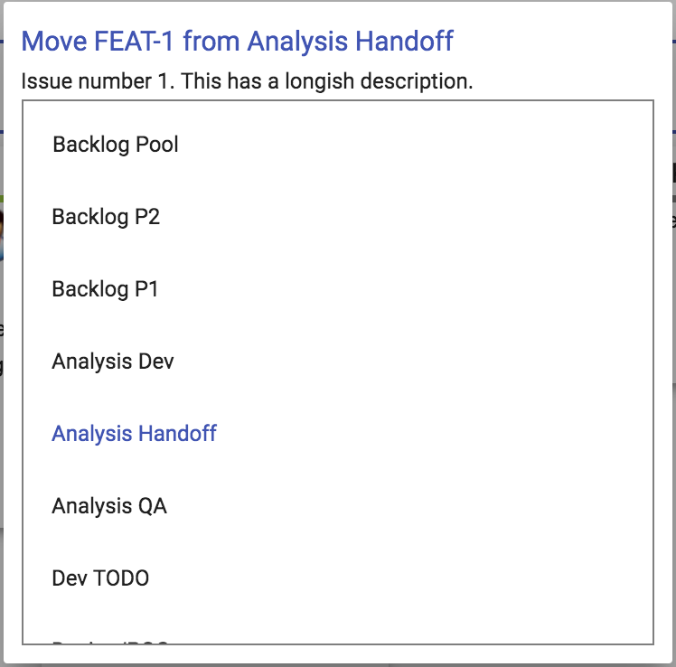

The list shows all the states this issue can move to, with the current state highlighted. The list is scrollable. 

*Note that Overbård assumes a workflow that allows moving to any state is allowed. If your Jira project uses a workflow that
has some restrictions on state movement, an error message will be displayed.*

This option is currently only available in the Kanban view.

#### 2.3.1.2 Rank

This option is only available in the Rank view, and **only** if you are logged in as a user who has permissions to
perform ranking in the Jira project (this is configured in Jira itself, **not** in Overbård). If you are one of the
lucky ones who can rank issues, after clicking on the 'Rank' issue context menu item you will get a list containing 
all the issues from that project:


The issue being ranked is highlighted. To rank it click on the issue you want to move it before.


#### 2.3.1.3 Comment

The 'Comment' issue context menu item will display a dialog allowing you to comment on the issue without opening the 
issue in Jira:


 
### 2.3.2 Parallel tasks

Note that these are only visible for boards that have been set up to use them. The parallel task icons are backed 
by drop down list custom fields in Jira, so although they are shown in Overbård the data is stored in the Jira issue
using standard Jira mechanisms, and is visible in the native Jira issues themselves.

To change the value of a parallel task in the issue we have been using as an example, click on it. In this case I have
clicked 'TD' (aka 'Test Development') and am presented with a pane to change its value. The current setting is 
highlighted, and for each colour on the scale from red (not started) to green (complete) a tooltip is displayed giving 
the name of each value.   


To change the value, click on the entry you wish to change the parallel task to.